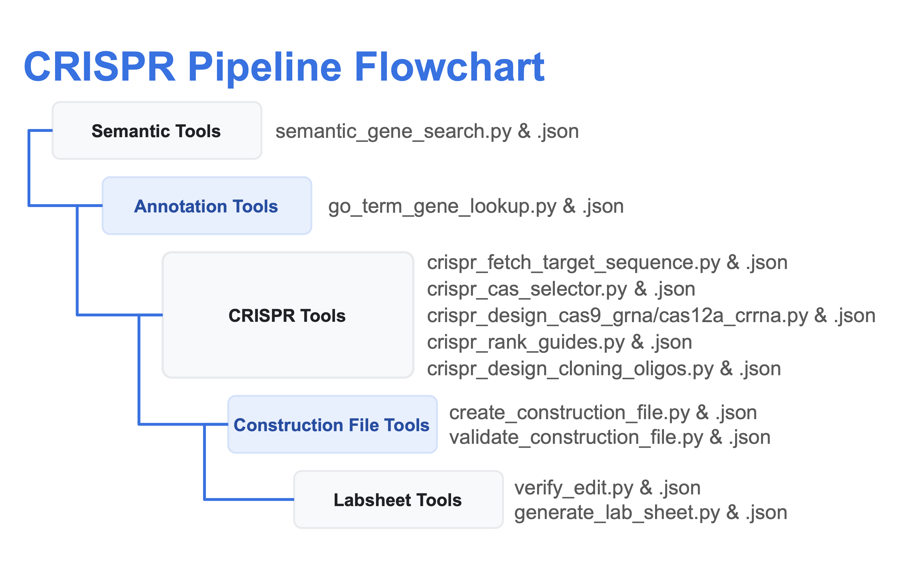

# BioE134/234 CRISPR Pipeline Project
Names: Emory Elizabeth Adelman, Jillian Ho, Karina Jin, Laney Seligson

Presentation slide: [click this](https://docs.google.com/presentation/d/1eYHWdArwtcOk_REBWtsuq_iwyRDxQa1vGYRxENukCQE/edit?usp=sharing)


---
## Table of Contents
1. [Overview](#1-overview)
2. [Project Structure](#2-project-structure)
3. [Demo](#3-demo-on-whole-pipeline)
4. [Setup](#4-setup)
5. [Individual Scope](#5-individual-scope)
    - [Karina](#karina)
    - [Emory](#emory)
    - [Laney](#laney)
    - [Jillian](#jillian)

## 1. Overview

Designing CRISPR experiments typically requires coordinating multiple tools, manual sequence handling, and careful validation, making the process time-consuming and error-prone. This project is a modular pipeline designed to streamline and automate the full CRISPR and cloning workflow, taking a user from <b>an initial idea to a lab-ready experimental plan</b>. Instead of handling each step manually, the system organizes the process into connected components that guide users through sequence selection, design, and validation in a structured way. It includes built-in gene and sequence lookup functionality, allowing users to start from a gene name, organism, or identifier and automatically retrieve the relevant DNA sequence for downstream design. The pipeline supports upstream and downstream design. Including but not limited to, identifying target sequences, designing and evaluating guide RNAs, oligo design, construction file creation, construction file validation, and lab sheet generation. Overall, the goal of this project is to create a more efficient, reproducible, and reliable approach to experimental design in synthetic biology by combining structured workflows with intelligent automation.

---

## 2. Project structure


---

## 3. Demo on whole pipeline
https://youtu.be/QgIpJ8BjLJQ 

---

## 4. Setup
You need to have at least Python 3.10 for this repos to work.

<b>1. Create a virtual environment </b>
Open a terminal in VS Code (`Terminal >> New Terminal`):
```bash
python -m venv .venv
source .venv/bin/activate        # Mac / Linux
# .venv\Scripts\activate         # Windows
```
You should see `(.venv)` at the start of your terminal line. Then install dependencies:
```bash
pip install -r requirements.txt
```

<b>2. Get your Gemini API key </b>
Get your gemini api key from **[https://aistudio.google.com/api-keys](https://aistudio.google.com/api-keys)**
In the project root folder, create a file named exactly **`.env`**.
Inside the file, paste the following.
```
GEMINI_API_KEY="paste_your_key_here"
```
<b>Never upload `.env` to GitHub. Ensure `.env` is listed in `.gitignore`. 
Run this in your project folder terminal: </b>
```
echo ".env" >> .gitignore
```

<b>3. Run the client </b>

```bash
python client_gemini.py
```
Once you see the 
```
Type a request. Ctrl-C to quit.
You: 
```
The client is ready and you can start entering prompts.

## 5. Individual Scope

### Karina:
<div style="margin-left: 20px;">
<b>1. Semantic Tool</b>

- What it does:
  - Uses natural-language biology queries to identify biologically relevant ontology terms.
  - Converts human-readable biological questions into structured ontology searches.
  - Example:
    - “oxidative stress in yeast”
    - “human genes involved in blood disorders”
    
- Code files:
  - `modules/semantic_tools/semantic_wrapper.py`
    - Main backend workflow for semantic searching.
    - Parses the raw user query.
    - Detects organism names from common aliases, such as:
      - “yeast” → `Saccharomyces cerevisiae`
      - “human” → `Homo sapiens`
    - Extracts biological keywords from the query.
    - Sends ontology search requests to OLS4.
    - Parses ontology API responses.
    - Selects relevant GO terms.
    - Formats ontology information into structured JSON.
    - Includes basic API error handling.
    - Returns:
      - parsed query
      - organism
      - ontology terms
      - GO IDs
      - GO labels
      - ontology definitions
  - `modules/semantic_tools/tools/semantic_gene_search.py`
    - MCP wrapper that exposes the semantic search backend as an MCP tool using the Function Object Pattern with `initiate()` and `run()`.
  - `modules/semantic_tools/tools/semantic_gene_search.json`
    - MCP metadata definition file describing the tool schema and registration information.
- Pytests (`tests/unit/test_semantic_wrapper.py`):
  - Tests organism extraction:
    - “yeast” → `Saccharomyces cerevisiae`
  - Tests ontology term parsing:
    - “oxidative stress” → “response to oxidative stress”
  - Tests GO term retrieval:
    - verifies `GO:0006979` is returned
  - Tests structured dictionary output from the semantic wrapper
- Sample Prompt:
  - “What GO ID is related to oxidative stress in yeast?”
- Output:
  <details>
  <summary>Click to expand sample output</summary>

  ```json
  You: What GO id related to oxidative stress in yeast?

  [Tool call] → semantic_gene_search
  {
    "query": "oxidative stress response yeast"
  }
  [Tool result] ← semantic_gene_search:
  {
    "parsed_query": {
      "raw_query": "oxidative stress response yeast",
      "organism": "Saccharomyces cerevisiae",
      "keywords": [
        "oxidative",
        "stress",
        "response",
        "yeast"
      ],
      "ontology_terms": [
        "response to oxidative stress"
      ]
    },
    "go_terms": [
      {
        "go_id": "GO:0006979",
        "label": "response to oxidative stress",
        "definition": "Any process that results in a change in state or activity of a cell or an organism (in terms of movement, secretion, enz\u2026 (345 chars)"
      },
      {
        "go_id": "GO:0034599",
        "label": "cellular response to oxidative stress",
        "definition": "Any process that results in a change in state or activity of a cell (in terms of movement, secretion, enzyme production,\u2026 (330 chars)"
      },
      {
        "go_id": "GO:1902882",
        "label": "regulation of response to oxidative stress",
        "definition": "Any process that modulates the frequency, rate or extent of response to oxidative stress."
      },
      {
        "go_id": "GO:1900407",
        "label": "regulation of cellular response to oxidative stress",
        "definition": "Any process that modulates the frequency, rate or extent of cellular response to oxidative stress."
      },
      {
        "go_id": "GO:1902883",
        "label": "negative regulation of response to oxidative stress",
        "definition": "Any process that stops, prevents or reduces the frequency, rate or extent of response to oxidative stress."
      }
    ]
  }

  Gemini: The Gene Ontology (GO) term for "response to oxidative stress" is **GO:0006979**.
  Other related terms include:
  *   **GO:0034599**: Cellular response to oxidative stress
  *   **GO:1902882**: Regulation of response to oxidative stress
  *   **GO:1900407**: Regulation of cellular response to oxidative stress
  ```
  </details>

<b>2. Annotation Tool</b>

- What it does:
  - This tool connects biological processes or ontology terms to possible genes.
  - Retrieves genes associated with a Gene Ontology (GO) term.
  - Uses the GO term label to search the NCBI Gene database.
  - Can optionally filter results by organism.
  - Returns structured gene annotations including:
    - gene ID
    - gene symbol
    - gene description
    - organism
- Code files:
  - `modules/annotation_tools/go_term_to_genes.py`
    - Main backend logic for annotation-based gene retrieval.
    - Defines the `GeneHit` and `LookupResult` dataclasses used for structured outputs.
    - Uses the NCBI E-utilities API to retrieve genes associated with a GO term.
    - `get_json()`:
      - sends HTTP requests, applies timeout/retry handling, returns parsed JSON responses
    - `search_gene_ids()`:
      - builds NCBI Gene search queries using: GO label, optional organism filter
      - retrieves matching NCBI Gene IDs using `esearch.fcgi`
    - `summarize_gene_ids()`:
      - retrieves gene summaries using `esummary.fcgi`
      - extracts gene symbol, description, and organism
      - converts records into `GeneHit` objects
    - `run()`:
      - performs the full workflow: search gene IDs, summarize gene results and return structured lookup output

  - `modules/annotation_tools/tools/go_term_gene_lookup.py`
    - MCP wrapper that exposes the annotation backend as an MCP tool using the Function Object Pattern with `initiate()` and `run()`.
  - `modules/annotation_tools/tools/go_term_gene_lookup.json`
    - MCP metadata definition file describing the tool schema and registration information.
- Pytests (`tests/unit/test_go_term_to_genes.py`):
  - Tests structured output shape:
    - verifies `go_id` is `GO:0006979`
    - verifies organism is `Saccharomyces cerevisiae`
    - verifies `genes` is a list
    - verifies at least one gene is returned
  - Tests plausible oxidative stress gene retrieval:
    - checks whether `YAP1` or `SOD1` appears in the returned gene symbols
- Sample Prompt:
  - “Find yeast genes associated with GO:0006979 response to oxidative stress.”
- Output:
  <details>
  <summary>Click to expand sample output</summary>

  ```json
  You: Find yeast genes associated with GO:0006979 response to oxidative stress.

  [Tool call] → go_term_gene_lookup
  {
    "organism": "Saccharomyces cerevisiae",
    "go_label": "response to oxidative stress",
    "go_id": "GO:0006979"
  }
  [Tool result] ← go_term_gene_lookup:
  {
    "go_id": "GO:0006979",
    "go_label": "response to oxidative stress",
    "organism": "Saccharomyces cerevisiae",
    "genes": [
      {
        "gene_id": "851752",
        "symbol": "SUP35",
        "description": "translation termination factor GTPase eRF3",
        "organism": "Saccharomyces cerevisiae S288C"
      },
      {
        "gene_id": "856831",
        "symbol": "RAD51",
        "description": "recombinase RAD51",
        "organism": "Saccharomyces cerevisiae S288C"
      },
      {
        "gene_id": "856709",
        "symbol": "GCN4",
        "description": "amino acid starvation-responsive transcription factor GCN4",
        "organism": "Saccharomyces cerevisiae S288C"
      },
      {
        "gene_id": "852876",
        "symbol": "PMA1",
        "description": "H(+)-exporting P2-type ATPase PMA1",
        "organism": "Saccharomyces cerevisiae S288C"
      },
      {
        "gene_id": "852088",
        "symbol": "SNF1",
        "description": "AMP-activated serine/threonine-protein kinase catalytic subunit SNF1",
        "organism": "Saccharomyces cerevisiae S288C"
      },
      {
        "gene_id": "852433",
        "symbol": "MEC1",
        "description": "protein kinase MEC1",
        "organism": "Saccharomyces cerevisiae S288C"
      },
      {
        "gene_id": "850803",
        "symbol": "HOG1",
        "description": "mitogen-activated protein kinase HOG1",
        "organism": "Saccharomyces cerevisiae S288C"
      },
      {
        "gene_id": "853568",
        "symbol": "SOD1",
        "description": "superoxide dismutase SOD1",
        "organism": "Saccharomyces cerevisiae S288C"
      },
      {
        "gene_id": "855005",
        "symbol": "YAP1",
        "description": "DNA-binding transcription factor YAP1",
        "organism": "Saccharomyces cerevisiae S288C"
      },
      {
        "gene_id": "856425",
        "symbol": "SLT2",
        "description": "mitogen-activated serine/threonine-protein kinase SLT2",
        "organism": "Saccharomyces cerevisiae S288C"
      }
    ]
  }

  Gemini: The following *Saccharomyces cerevisiae* genes are associated with the GO term **GO:0006979 (response to oxidative stress)**:

  | Gene Symbol | Description |
  | :--- | :--- |
  | **SUP35** | Translation termination factor GTPase eRF3 |
  | **RAD51** | Recombinase RAD51 |
  | **GCN4** | Amino acid starvation-responsive transcription factor GCN4 |
  | **PMA1** | H(+)-exporting P2-type ATPase PMA1 |
  | **SNF1** | AMP-activated serine/threonine-protein kinase catalytic subunit SNF1 |
  | **MEC1** | Protein kinase MEC1 |
  | **HOG1** | Mitogen-activated protein kinase HOG1 |
  | **SOD1** | Superoxide dismutase SOD1 |
  | **YAP1** | DNA-binding transcription factor YAP1 |
  | **SLT2** | Mitogen-activated serine/threonine-protein kinase SLT2 |
  ```
<br>
<b> 3. Locus Tool (Not used in pipeline)</b>
<details>
<summary>Click to expand details</summary>

- What it does:
  - Retrieves genomic locus information for genes.
  - Can return chromosome accession, genomic coordinates, strand direction, and optional FASTA sequences.
  - This tool was part of an earlier version of the pipeline and is not integrated with the main pipeline.
- Code files:
  - `modules/locus_tools/gene_locus_lookup.py`
    - Main backend logic for genomic locus retrieval.
    - Uses NCBI Gene and nucleotide records to retrieve genomic coordinate information.
    - Returns structured locus metadata and optional FASTA sequences.
  - `modules/locus_tools/tools/gene_locus_lookup_tool.py`
    - MCP wrapper that exposes the locus backend as an MCP tool.
  - `modules/locus_tools/tools/gene_locus_lookup_tool.json`
    - MCP metadata definition file describing tool schema and registration information.
- Pytests (`tests/unit/gene_locus_lookup.py`)::
  - Tests locus coordinate retrieval.
  - Tests FASTA sequence retrieval.
  - Tests structured dictionary output.
- Sample Prompt:
  - “Find the genomic locus for YAP1 in yeast.”
- Output:
  <details>
  <summary>Click to expand details</summary>

  ```json
    You: Find the genomic locus for YAP1 in yeast.

    [Tool call] → gene_locus_lookup_tool
    {
      "organism": "Saccharomyces cerevisiae",
      "gene_symbol": "YAP1"
    }
    [Tool result] ← gene_locus_lookup_tool:
    {
      "query_gene_symbol": "YAP1",
      "query_gene_id": null,
      "organism": "Saccharomyces cerevisiae",
      "resolved_gene_id": "855005",
      "resolved_symbol": "YAP1",
      "gene_description": "DNA-binding transcription factor YAP1",
      "loci": [
        {
          "chr_accession": "NC_001145.3",
          "chr_loc": "XIII",
          "start_0_based": 253847,
          "stop_0_based": 255799,
          "start_1_based": 253848,
          "stop_1_based": 255800,
          "strand": "plus",
          "exon_count": 1,
          "fasta": ">NC_001145.3:253848-255800 Saccharomyces cerevisiae S288C chromosome XIII, complete sequence\nATGAGTGTGTCTACCGCCAAGAGGTCG\u2026 (2075 chars)"
        }
      ]
    }

    Gemini: The *YAP1* gene in *Saccharomyces cerevisiae* is located on **Chromosome XIII**.

    Here are the details:
    *   **Gene Symbol:** *YAP1*
    *   **Chromosome:** XIII
    *   **Genomic Coordinates (1-based):** 253,848 – 255,800
    *   **Strand:** Plus (+)
    *   **NCBI Gene ID:** 855005
  ```
  </details>
</details>

<br>
<b>4. Sequence Tool (Not used in pipeline)</b>
<details>
<summary>Click to expand sample output</summary>

- What it does:
  - Retrieves nucleotide sequence records associated with genes.
  - Can optionally return FASTA sequences.
  - This tool was used in an earlier sequence retrieval workflow before the current CRISPR pipeline integration.

- Code files:
  - `modules/sequence_tools/gene_sequence_lookup.py`
    - Main backend logic for nucleotide sequence retrieval.
    - Uses NCBI Gene and linked nucleotide records to retrieve accession and sequence information.
  - `modules/sequence_tools/tools/gene_sequence_lookup_tool.py`
    - MCP wrapper that exposes the sequence lookup backend as an MCP tool.
  - `modules/sequence_tools/tools/gene_sequence_lookup_tool.json`
    - MCP metadata definition file describing tool schema and registration information.
- Pytests:
  - Tests nucleotide record retrieval.
  - Tests FASTA sequence retrieval.
  - Tests structured output formatting.
- Sample Prompt:
  - “Retrieve nucleotide sequence records for YAP1 in yeast.”
- Output:
  <details>
  <summary>Click to expand sample output</summary>

  ```json
  You: Retrieve nucleotide sequence records for YAP1 in yeast.

  [Tool call] → gene_sequence_lookup_tool
  {
    "gene_symbol": "YAP1",
    "organism": "Saccharomyces cerevisiae"
  }
  [Tool result] ← gene_sequence_lookup_tool:
  {
    "query_gene_symbol": "YAP1",
    "query_gene_id": null,
    "organism": "Saccharomyces cerevisiae",
    "resolved_gene_id": "855005",
    "resolved_symbol": "YAP1",
    "gene_description": "DNA-binding transcription factor YAP1",
    "nucleotide_records": [
      {
        "nucleotide_id": "330443688",
        "accession": "NC_001145",
        "title": "Saccharomyces cerevisiae S288C chromosome XIII, complete sequence",
        "fasta": ">NC_001145.3 Saccharomyces cerevisiae S288C chromosome XIII, complete sequence\nCCACACACACACCACACCCACACCACACCCACACCCACACC\u2026 (937718 chars)"
      },
      {
        "nucleotide_id": "329138949",
        "accession": "BK006946",
        "title": "TPA_inf: Saccharomyces cerevisiae S288C chromosome XIII, complete sequence",
        "fasta": ">BK006946.2 TPA_inf: Saccharomyces cerevisiae S288C chromosome XIII, complete sequence\nCCACACACACACCACACCCACACCACACCCACA\u2026 (937726 chars)"
      },
      {
        "nucleotide_id": "296147112",
        "accession": "NM_001182362",
        "title": "Saccharomyces cerevisiae S288C DNA-binding transcription factor YAP1 (YAP1), partial mRNA",
        "fasta": ">NM_001182362.1 Saccharomyces cerevisiae S288C DNA-binding transcription factor YAP1 (YAP1), partial mRNA\nATGAGTGTGTCTAC\u2026 (2088 chars)"
      }
    ]
  }

  Gemini: I have retrieved the nucleotide sequence information for the *YAP1* gene in *Saccharomyces cerevisiae*. 

  The **NM_001182362.1** record provides the partial mRNA sequence for *YAP1* (DNA-binding transcription factor), which is useful for tasks like primer design. You can also find the gene within the context of the full chromosome XIII sequences (e.g., **NC_001145**).

  *   **NCBI Gene Symbol:** *YAP1*
  *   **Accession (mRNA):** NM_001182362.1
  *   **Description:** DNA-binding transcription factor YAP1

  If you need to perform specific analyses, such as guide RNA design or sequence translation for a specific region, please let me know!
  ```
</details>
<br>
<b>Citation:</b>

  - James McLaughlin, Josh Lagrimas, Haider Iqbal, Helen Parkinson, Henriette Harmse, OLS4: a new Ontology Lookup Service for a growing interdisciplinary knowledge ecosystem, Bioinformatics, Volume 41, Issue 5, May 2025, btaf279, https://doi.org/10.1093/bioinformatics/btaf279
  - Sayers E. A General Introduction to the E-utilities. 2009 May 26 [Updated 2022 Nov 17]. In: Entrez® Programming Utilities Help [Internet]. Bethesda (MD): National Center for Biotechnology Information (US); 2010-. Available from: https://www.ncbi.nlm.nih.gov/books/NBK25497/
</div>


## Emory Adelman — CRISPR Toolchain

My tools support CRISPR education and wet-lab protocol design. Every design decision — vector selection, guide scoring, primer logic — is backed by literature citations. The workflow begins when the user provides a gene name: the tool fetches the genomic locus or coding sequence from NCBI, selects a Cas nuclease using a heuristic I developed (the nuclease with more high-quality PAM-compatible guides wins), designs and ranks up to 10 guide sequences, then passes the best guide and all cloning variables to teammates' tools for construction file and lab sheet generation.
      


## 1. run_full_crispr_workflow

- What it does: 
  - NEEDS gene and Organism name to successfully call tool 
  - Fetches a target sequence, genomic locus or cds from the NCBI GenBank file for the gene chosen 
  - design guide or crRNA sequence using the 10 found in the fetched sequence, meant to cover the gene broadly from PAM-based windows across the whole sequence 
  - rank guide and crispr RNAs with 'rank_guides.py', authored by Jillian and I, and find the single best one to use out of the 10 
  - off-target prediction and on-target efficiency is calculated with tools such as '_predict_editing_efficiency.py' and 'predict_offtargets.py' 
  - design cloning oligos 
  - prepares construction file inputs 

The MCP will then stop and ask if the user wants to generate a construction file or lab sheet, then Laney and Jillian's tools are called.

**Example shown at bottom in appendix, this output is very long** 

Possible Unhappy Paths:
- A user may say "Run full CRISPR workflow on genes that cause cystic fibrosis in Homo sapiens." If only a disease name is given, semantic tools are called to identify a target gene before the workflow proceeds.
- After gene resolution, the organism is occasionally re-prompted if it was inferred rather than explicitly stated.
- Vectors are not always known; the MCP supplies organism-appropriate recommendations or waits for user input before calling `design_cloning_oligos`.
- Construction file regions that cannot be determined are printed as incomplete or `"N"` — users should review those fields before submitting to wet lab.
 
- MCP Wrapper: `run_full_crispr_workflow.json`
- Pytests (`tests/unit/test_run_full_crispr_workflow.py`): guide selection, vector prompting, workflow confirmation gate, upstream-selected gene confirmation, empty query error, per-guide score fields
- Sample Prompt: “Design a CRISPR edit targeting lacZ in E.Coli using pTargetF.”

## 2. fetch_target_sequence
- What it does: 
  - Resolves a gene name or accession to a clean DNA sequence using NCBI Entrez tools
  - Closely related to Karina's gene lookup tool integrated directly into `run_full_crispr_workflow` for semi- seamless end-to-end operation
  - Uses `_utils.normalize_organism()` to canonicalize common organism aliases (e.g. "e. coli" → "Escherichia coli") before any NCBI call

  Contains 'fetch_locus_from_ncbi' which uses esearch for the gene ID,esummary for the chromosomal coordinates, and efetch to get a fasta slice from designated region of the chromosome 

  Also,'fetch_cds_from_ncbi' function makes it so we have a esearch for gene ID, elink for RefSeq mRNA accession IDs, and efetch to extract CDS from a GenBank record.  
  
  
  Future work:

  If the organism is unspecified or the gene name is ambiguous, the tool raises an error and defers to Karina's semantic search tools. A planned improvement is to replace this tool entirely with Karina's `gene_sequence_lookup_tool` and `gene_locus_*` scripts, which can infer more context. The key difference is that the current tool is stricter — it raises an error rather than returning a possibly incorrect gene — while Karina's tools can deduce more from natural language input.
  
  - MCP Wrapper: `fetch_target_sequence.json`
  - Pytests (`tests/unit/test_fetch_target_sequence.py`): raw DNA passthrough, uppercase normalization, invalid DNA error, empty query error, required output keys
---
  - Sample Happy Prompt: “Fetch the sequence for sma-2, sma-3 and sma-4 in C.elegans.” 
  
  Notice that all genes are formatted simply and that the organism is stated. This is usually the way this tool works best. 

  - Output:


<details>
<summary>Click to expand sample output</summary>
        
      ```json
      You: Fetch sequences to edit sma-2, sma-3, and sma-4 in c.elegans             
      [Tool call] → crispr_fetch_target_sequence
      {
        "organism": "Caenorhabditis elegans",
        "query": "sma-2"
      }
      [Tool result] ← crispr_fetch_target_sequence:
      {
        "sequence": "GGACACAAGTTGACTGTCGCCGGGTGGAAACACATCTGTGAAGATGATTGCACAATTTGGAGAGACGGAGAGTTGAAAACAATGAGTAGACAGTTAGACGGTTGATGATGGGCTGGTGAA\u2026 (7410 chars)",
        "source": "ncbi",
        "resource": "sma-2",
        "organism": "Caenorhabditis elegans",
        "target_type": "genomic_locus",
        "ncbi_gene_id": "176229",
        "ncbi_accession": "NC_003281.10",
        "length": 7410,
        "note": "Fetched genomic locus from NCBI Entrez: gene 'sma-2' in 'Caenorhabditis elegans'. Nucleotide record: NC_003281.10. Verif\u2026 (173 chars)"
      }
      
      [Tool call] → crispr_fetch_target_sequence
      {
        "organism": "Caenorhabditis elegans",
        "query": "sma-3"
      }
      [Tool result] ← crispr_fetch_target_sequence:
      {
        "sequence": "TCAAAATGAACGGATTACTGCATATGCATGGTCCAGCTGTCAAAAAGCTTTTAGGTTGGAAAATTGGAGAAGACGAAGAAAAATGGTGTGAGAAGGCTGTTGAGGCATTGGTGAAAAAAT\u2026 (2995 chars)",
        "source": "ncbi",
        "resource": "sma-3",
        "organism": "Caenorhabditis elegans",
        "target_type": "genomic_locus",
        "ncbi_gene_id": "175955",
        "ncbi_accession": "NC_003281.10",
        "length": 2995,
        "note": "Fetched genomic locus from NCBI Entrez: gene 'sma-3' in 'Caenorhabditis elegans'. Nucleotide record: NC_003281.10. Verif\u2026 (173 chars)"
      }
      
      [Tool call] → crispr_fetch_target_sequence
      {
        "query": "sma-4",
        "organism": "Caenorhabditis elegans"
      }
      [Tool result] ← crispr_fetch_target_sequence:
      {
        "sequence": "TTCTCGAAAAACGTCTGAATTGGTCGAATAATGTTTCATCCAGGTATGACATCTCAGCCGTCTACTTCTAACCAAATGTATTATGATCCTTTGTATGGAGCAGAGCAAATTGTACAGGTG\u2026 (3966 chars)",
        "source": "ncbi",
        "resource": "sma-4",
        "organism": "Caenorhabditis elegans",
        "target_type": "genomic_locus",
        "ncbi_gene_id": "175815",
        "ncbi_accession": "NC_003281.10",
        "length": 3966,
        "note": "Fetched genomic locus from NCBI Entrez: gene 'sma-4' in 'Caenorhabditis elegans'. Nucleotide record: NC_003281.10. Verif\u2026 (173 chars)"
      }
      
      Gemini: I have fetched the genomic locus sequences for your target genes in *C. elegans*: **sma-2**, **sma-3**, and **sma-4**.
      
      I am ready to help you proceed with the CRISPR design workflow for these targets. Because you have multiple target genes, I will follow the multi-target workflow:
      
      1.  **System Selection**: I will run the `crispr_cas_selector` on each sequence to determine the recommended nuclease (Cas9 vs. Cas12a).
      2.  **Guide Design**: I will proceed with guide design based on that recommendation.
      3.  **Aggregation**: I will then aggregate these results to provide a unified strategy.
      ```
</details>
  
  
  - Citations: 
    - National Center for Biotechnology Information. n.d. "Entrez Programming Utilities Help (E-utilities)." U.S National Library of Medicine. https://www.ncbi.nlm.nih.gov/books/NBK25501/.
  
    - National Center for Biotechnology Information. n.d. "Gene Database Help." U.S. National Library of Medicine. https://www.ncbi.nlm.nih.gov/books/NBK3841/.
  
## 3. cas_selector
  - What it does: 
  - Recommends Cas9 or Cas12a based on guide availability, multiplexing needs, and specificity requirements by scanning the full genomic locus (or CDS if specified) from `fetch_target_sequence`
  - For multiplexing: results across multiple genomic loci are aggregated by majority vote
  
  > **Note on AT-rich genomes:** Cas12a may provide broader targeting coverage in AT-rich genomes because TTTV PAMs can become more abundant than NGG PAMs — but this is a heuristic based on PAM density, not a universal biological rule. The selector uses guide count ratios, not GC alone, to make the recommendation (Zetsche et al. 2015; Kim et al. 2016).
  
  Possible Unhappy Paths: 
  If a person is not specific with the gene name, semantic tools will be called along with fetch sequence. The user will then have to go through a series of questions to find genes of interest. 
  
  - MCP Wrapper: `cas_selector.json`
  - Pytests (`tests/unit/test_cas_selector.py`): GC-rich → Cas9, AT-rich → Cas12a (PAM-density heuristic), multiplexing override, empty sequence error
---
  - Sample Happy Prompt: “Which Cas nuclease should I use for sma-2, sma-3, and sma-4 in c.elegans? 
  - Output:


<details>
<summary>Click to expand sample output</summary>

        ```json 
        You: What Cas system would I use to edit sma-2, sma-3 and sma-4 in C.elegans all at once?
        
        [Gemini busy (503). Retrying in 2s...]
        
        [Gemini busy (503). Retrying in 4s...]
        
        [Tool call] → crispr_cas_selector
        {
          "seq": "GGACACAAGTTGACTGTCGCCGGGTGGAAACACATCTGTGAAGATGATTGCACAATTTGGAGAGACGGAGAGTTGAAAACAATGAGTAGACAGTTAGACGGTTGATGATGGGCTGGTGAAGCTGAGAACAATTTATGAGATACCAGGCACTTTAGAGAGGCTACAGAGGTAGAAAGAAAAAAAGGTAAAGGAGTGCGCATTTACAGGCTATTTTCAATGTTTCTTATTTATAGAATCTTCTTGTGATCTATTAGTTTTTACAATATTTCAAGAAGATTAGAATCATGGTAAGTTTTTATTTGTATTTAAGAATAAACATTCAAAAAAAATTCGAAATTTTGTAATTCAAATTTTTTAAAGAAAAAAAAAAATAGAATTCAAATTGTTGAACTCAATGAGTCTTTAAAATTTTGAAAAAAATACGAAAATCATTTTTAAAAATTTCAAAAAATGTAGCTACATTTTTTATGTTTTCCTATAAAGAATTTGTTTAAAAATTTCCCAAAATATTGTTGTGAAATAAGAAACTGAAATATCTTCTCGATATTGTCTAACCACTACCAGTTTGTAAAAATTATTATTACTTCCTCAAAACCAGGGCCTTGAGTCCTGGAACGTGTGTAATTTTTCAGCTACAGTACCCCGTGAACACCATAGACTTTGAAATTCTCAGCTTTCAAAGTTTGAACCTTCCGTTTTACATATTTTAATATTTGACGTAGTTTAAACATTTTTCCAAAATATGTGATTTCTACAATAAAATTCTTGAAAAAATCGAGACAAGAGAGACAAATAGTAATAGAGAGTACGGTAGCTGAAAAATTTCATTCGTATCAGAACCCAATTCCCAAGAATTCTTATTTTTCGAAAATAGATAAAATTGTATAACCATTTTTTATTTCACAACAAAAAACCACGAACCTTTCAGATAAACTTCGACGGAATAAAAAAGATCACGGAGAGACTGAAATGGAAACAAGGTAAGTCTCATTTTTGTCCAAAAGACCAATAGGGTGGGGAAATATTACAATCAACGGCGGAAATCTAGAATCGAAACTGAAATCGGATTTCTGACGGAAATAAGTATTTTACAGGAGACGAGGATGAGAATTGGGCAAAAAAGGCGATCGACAACTTGATGAAGAAGCTGATAAAGCATAACAAGCAGGCGTTGGAAAATTTGGAATTCGCGTTGAGGGTTCATGTGTTTTGTGTCTTTTGAATCTTTCAATTTGATCTTAAGATTTCTTTTTTATGAATAGAAATGAAATAATCTAGCAATAGACTACACATACTTTAAACTCGTTAAAAATCAATAAAAACTACATATATCCGATATTTCAATCGTAGAATAACCTCAAATCAATAACTATATCATTTCAGTGCCAAGGACAACAAAAAACCGAATGCGTGACAATTCCGCGGTCACTAGATGGACGACTTCAAATTTCGCATCGAAAGGTGATTTTAGTATAGAATAAGAGAATAATGGGGAGAAGAAGTAAACAAATTCAAAATGAAGGGGTGCCCTATTTGTTTATGAACATCAACTAGAAACAGAGACAGACTTACTTATTCGATTAATCGACCGACTAGATTTTGAAAAATGATATTAAATTTTTAAATTGTAAAATTGTGTCAACTAGTCGTTTGAACAATTTCAAAAATTGATTTGATCTTTTTTGATTTTATGGGCAAAAGTCCACGTGTCAGTCCCATTTGCATTTTTAATTTATAAATTTGCATAATTTCTACAGTACATCCTAACGATATTAGAAAAAACATAGATTTTTCTGCTAATTTTTTGATATTTTCACAAAAATTACACCAGCCAAAACTTAACCTAGATTATGAAAAATCATATTAAATTTATGAAATTTAAAAGTTTAAAAAATTTATAAACGTTAGCTGATCTTTTGTTCGATTTTCAATTTTTTTTGAAATGAAGCTTCTTCGTGAAATGCTTGTTTGAACAGCTGGAGATTATCATTTTTCACAGAAAATTCAAATAATCCACTCTGAGAAAAAATGTTAGGAACAATTCCAAATCCTATGTACTAAAAATTCAGGCACTTCCTCATGTGATATATTGCCGTGTCTATCGTTGGCCAGATCTTCAATCACATCATGAATTGAAAGCAATTGAAGATTGCCGATTCTGCTACGAATCAGGGCAAAAGGATATTTGCATTAATCCATATCATTACAAAAGAGTTCATGCAACTGGAGTACTTCCACCAGTTCTTGTACCTCGTTATTCCGAGAAACCACCACAAGAAGTGCCCCCAACTCTGGCGAAATTTCAGTTGATGGAGATGAGCGGATCAAGAATGCCGCAGAATGTCAATATGGCAAACGTTAATTTTACGTAAGTGTTTAAAAAATATATGGTATTACTGATTGAAGAAAAATTGAAATATCTGGTATTTATGAGATTATCGGGAACAAAAAAACAAAAAAGCGAAGAATAAAATAAGAAAACGAACACAGTAGGTAAGGAACGGAACTGGAAAACGGATGGGTTGATTTTGAGAAACCCGAAAACTTAAAAAAAAAACGGGGAAATGAGGGGAAAAACAGGTAACAAAGCAGCCTATCAACTATTCAAAAATTCTTTAAATTAATACATATCGAGCATTTCAGCTGCACGTTTCTTAGCATTCATCAATGGAATCATTCTCTTCAACATGAGAAGTTCTCGTGGTGGGGCAAATAGAGCTGCATTTCGAATTGATTCCATTGCTCGCTCGTAATTTTCTCTGAAAGGACTTGGATTTTTTAGTGGAACTCTGAAACTTTTTTACTTACTTCTTGATCATCGGCTCTGGCCCGTTAGTTCCCAAAAGATGAAGAACGTGAGCCGAGAAATTGAATGGATCAACTGCAATTGCTGCGTTGGCACTTTCAGTTGTCAATCTGAGTCGTTCAGCTTCTGGTTTGTGCACGTGGAGATCACTGGAAAATTAATTGTATTTAACGTAGAACTTAGAAGCCGATGGGAATTTCAATTTAAAATTCGCAGGCTGGTCCCTAATGACGTGATTGAACAAAAAATTCGCACTTTTTGATTTTTCAACTTTCCGATAGCTTAAATTTTTGCCATTTTCCTTCCTTTTAAAAGAAAATTATACTTCTTCTTTTTTCAACAACAGAAACAAAATTTATTTCAAAAATCGAATTTTATGAGTATATTCTTCGATTCTTTTTTTTTTTTTTTTGAAAAAAATCGAAAAGTCAAAAAAAATTTTTAATTTTCGATTTTTTGTTTTATTTTTTTTTTCATAAAATCTCGGCAACTGGTACCAGTCGGCGAATTTCAGAAAATTAAAATCTAAACTTACGCAGTCTGCAAATGCCTACTTGGCACCAAATATCTCGTAGTAATCCTTGCAGCCTCTTCGAGCAACTTCTTCGAGCTCTCCTCATTATTAGTCATCATATATACTTTGGACATAAGAACCAGATTGAAATGAGTAGATCTACTCTCTGCGAGTTCTTCCATTTCTCGGATTCGTCGATGAACATCAGCGTAGTCTTCGCTGGTACACAACTTCAGGAATGTAACAATCATGGAAAGATGTGGAGTGAGAGTTCCGTTCTTTTCAGCTTCTGTGAGAAGTCTATTGGCATTGTTCTGGAAAATTAAATAATTATAAATAAGAAAATTATGAATTTAAATTTACTGTATCCGCCATCATTTGTTGCTCATGATTCGTCACTGCTGTATCGAGAACACATCCATTATACTGAAACCATATTTTTAGAGAATAAAAATGATTTAATCGAATTACCACAAAAATAGATGCAAACGAATAAAGTTTGAAAAGTCTTTCCTTATCGTCTTTTGGAACTGATTCCAGGAATCTGAAAATTAGAAAAAATTAGACAAGACCTGGAAATATTTTGGAAAATCAAGAAAAAAAACTAACTTATCCAAATCTGCCATAGTATACATTAGCTCAATCTTGAGAATATCGAAAGCATCTCTCATTAGTTTTTTGCGTTCCTCATCCTCTTCTGATCCAATCAGTTCGTTAATTTTTGCTCCAACTTTATCGATATATCTCGTTGCCTCGTTAGGATCAGTACTGTAGCTTAGCATTTTTCCACGCAAGATCATTGCCGGAGGATAGCTGTTTTCCTCAGTAAGCAGATCAATCAGTTCTTCGTATTTTCCTTTTTTGAACTTTTCCAGTGCAAGTTGGTATTGTCTGAAATTTATAATTATTTTTACTGTATATCTAGAATTAGAGCTTACTTCTGGTCTTCACTGAGCACTTCTGGTTCGAATCTGGTGAGATCTGTTTTGAAAAGATCAAGAATATCCCAAGTATCACACCACTGCTGAATTCTGAACAAAGCTACTGGCTGTGGCTTAACATCTTCGATTTTGAGTGGTTTTCCAATGTGACAGTCGGACATCTAGAATAAAAAGTTGAGTTTCTTTAAGAAATTGTTAGGCTCTTACGGGTTCTATAGCAAGAAGCTTTCCAAAGAATTCGAAATTCGTCTTATTCAGGCTAGAATCCAAAGTGAACGCGGCAAGAAGATCTAAAAACAGGAATTGATACTTTTCTCGTAACATCTTCAGAAACTCACACGCCAGAGCATCCTGTTTCTTTCCGACGTCATTAAGTGCTTTTGCTGCTCTCAAGTATGCTTTGGTGTATTTTTTGTCTACTTTCAATGCAGCCATACAGTCGTTGAGGATATCAAAAGGGCTGTGTCCAACCTTTTCACGACAGGCTGCACGATTTTGGTAGAGCATTGCGACAATTTGATCAGAAGAGTTTGGTCCGGCCTTTTCGACTCCTTTTGTGAATGCTTCTAGTGCGGAATCGTATTGTTTCTCTTTAAACTTCAAATTTCCCAATGCTTTTATTTCCTCCAAGTCCCTTTCCAGCTGAAATTAGTTTTGAAATTGATATCATTGTACACTAGAAACTCACGTCTGAACCTCCAAAACTCTTATATACCAAGTATCCTACACCTGCAACTGTCGCTGCAGCTGCCACACCGATCAGCACTTTTTTCGTTTGGTCGCTGATTCCAGTCGTTTCGACCATTATATCTACAAAATAATAAATAGATAAATGATATAAGTTAAGATTAAGTTAGAAAAATTGAGAATTCAAAGAGAATGAAGAAAAATTGGTAAAATGATGTAAAATTTCAGTGATAAGAAAAGTAGGCAATATTTACGATAAACAGCATGCGGTGGAATTCCGGAGTATCGTCGCAAGTTGTAAATAAAATTGGATCCAAAATAACTTTGAGAGGGAAAAGGTTACGAAAAGAAAAAAAGGTTGAAATATTATCAATATATTTTCTAATTAGGGATTTAATAAATAATTTTCTAGAGCCAACCAATTTCATCAATACAATCCAAATGGAATTGAGGAAATGGATACTTCTCAGAAATTCGACATTCCACCAGGAGTTCCAACATGTCTCGTGCCATTCGATAAAGTTTGGGAAGAACAATTCTGGGCAACTGTTAGCTATTATGAATTGAATACAAGAGTCGGAGAACAGGTTAAAGTGTCTTCAACAACTATAACTATCGATGGATTCACTGATCCATGCATCAATGGAAGCAAAATTAGCCTGGGACTGTTTTCGAATGTAAATCGAAATGCAACTATTGAAAATACAAGAAGACATATTGGAAACGGTAAGAGCACCCACGGCCTCGCCACGAACGAATTACTTTCAAATCAAGGCCGAGCAAAACACGCGTGCGCCTTCAAGAAGTACAGTAACCTGATTTTCGGGAGATTGGGTACCGTACTTCGGCGCATAATTTTTGCAAGACTATGACTAAAAAATTGAAAATTTTCAAACTTTTTGTAATTCCAGGTGTCAAGCTAACCTACGTACGTAGCAATGGCTCACTCTTTGCTCAATGTGAAAGTGATTCAGCTATATTCGTACAATCTAGTAATTGTAATTATATCAATGGATTTCACTCAACAACTGTTGTTAAAATTGCAAATAAGTGTTCACTGAAGATTTTCGATATGGAGATTTTTAGACAGGTAAGCTAATTCACGTAATTGCAATGTTTGAGTCAAGAAAAGGTCTCGTCACGCACAAAATAACTTAAAATTGCAGTCTCACAGCAATATGTGTACCTTTAAGCAGTACGGTAGCCTATTCTTATACTTTTTGAAAAAAACTGGGTTACTGTACTTTTTAAAGGTACACACATTAAAACTGGCGAAGCCATGTTCTTGGGCAAAAAATAGTAACTGAAACTATTAGGTCTCCAAATAAGTTCCGGGTCAAAAATCATAACTTTGTTCACTGCGTATCGATTTTTATGAAACTGTGGGAATTTATGTTATCAACCATGATCTTTCATTTGACAATAGTCACAAAATTTTTTTGCCGTCCGAAGTGCCCTAACTCGGAGCCAAATTTTTCAGGCATTTTTCAGATCTCGCTTCTTTTACGTTTTGATTTGAGGTTCGTGTGCGGATTTAGCTTTGTTTAGTACACAATGTAAGAAAACAAGAAAAGTTTGGAAAAAATCCGTTAAAAAAAAAATTTTTTTTGTCGGTCGTCAAAAAATGTTCAAAAAAATTTTTGTCCAAAATTCTTGATTTTTCATACAAAAATGATGTAACCATGTGCAAAATAAATAGTTTGCACATGGTTACATCATATTTGTATAAAAAATCAAGAATTTTCGACAAAAACTTTTTTGAGCATTTTTTGACGACCGACAAAAAAATTTTTTTTTGGACGGATTTTTTTCTAAACTTTTCTTGTTTTCTTACATTGTGTACTAAACAAAGCTAAATCCGCACACAAACCTCAAATCAAAGCGTAAAAGAAGCGAGATCTGAAAAATGCCTGAAAACATTGGCTCCGAGTTAGGGCACTTCGGACGGCCAAAAAATTTTGTGACTATTGTCAAATGAAAGATCATGGTTGATAACATAAATTCCCACAGTTTCATAAAAATCGATACGCAGTGAACAAAGTTATGATTTTTGACCCGGAACTTATTTGGAGACCTAATAAGAAAAACTAAATTTTTCAGCTTCTCGAGGACTGCAGTCGCCGTGGATTCGACGCCTCATTTGATCTACAAAAAATGACATTTATTCGTATGTCATTTGTCAAAGGTTGGGGAGCTGAATATCAACGACAAGATGTCACTTCAACACCTTGTTGGATTGAAATTCATCTTCATGCTCCATTGGCTGTAAGTTCTGAAATTCTTGTTTTCTTTAGAAATAATACAATTTTCAGTGGCTCGACCGAGTTTTGTCTACAATGGGTCCAACTCCACGGCCAATTTCTTCAATTTCTTGAATCATTTTTATTATTTTTCAAATAACACTACCTTGTTGAATTGGAATCAGAAATAGAATAATAAAACAAAAAAAAAACAAACAAAGA",
          "repair_template": false,
          "organism": "Caenorhabditis elegans"
        }
        [Tool result] ← crispr_cas_selector:
        {
          "ngg_count": 422,
          "tttv_count": 489,
          "cas9_valid_guides": 143,
          "cas12a_valid_guides": 102,
          "gc_content": 0.34,
          "recommendation": "Cas12a",
          "rationale": "Guide counts are within margin: 143 valid Cas9 guides vs 102 valid Cas12a guides (ratio 1.4x < threshold 3.0x; GC 34%); \u2026 (738 chars)"
        }
        
        [Tool call] → crispr_cas_selector
        {
          "seq": "TCAAAATGAACGGATTACTGCATATGCATGGTCCAGCTGTCAAAAAGCTTTTAGGTTGGAAAATTGGAGAAGACGAAGAAAAATGGTGTGAGAAGGCTGTTGAGGCATTGGTGAAAAAATTAAAAAAGAAAAATAATGGATGTGGTTAGTCAAATATATTTTTTAAAGGAATTTATAATAATTTAGGGAGGGACATTTCTGAAAAAGGGTCTCGACGCGCTTATGAAAGTTTCAAAACTATTTTTGTGATTACCTTTAAATTTACAGTAGAAATATTTGAGCCTCCTTCCTCTTAGTCTAATTTTTCTTACGATTTCTTATGATTTTCATTTTTTTTAACTTGCAAAAAACTATAAAAACAGTAAGAAGAAAGCACCAAAAAACAAACTTAACATTTTCGAATGTATTCGAAAATACTATTGGCGCGGCGAGACCCATCCGAATGTTAAGCATATTGTTACGGATACAATATAATATTATGATTAACATTTTCCGATGACCCTTTTCGATTCATGAATCAAAGTGCACCTTATTTATAAGTTAGATCATAAATATTAAAAAAAAAGAAATTCAACCGATCCATTTCAAATTCTAAATTCCAGGAACCCTCGAAGATCTGGAATGTGTTCTAGCAAACCCATGTACAAACTCAAGATGCATTACGATAGCAAAAAGTTTAGACGGTCGGTTACAGGTATGTGGCGCCGTTGTGGTTGCTTAACGTAAATTTGTTCGCTAATCAGACAACTGTGATAACTTTCAAAAATAACACTTTGGTTTGAAATAACGACTTTTTGACGCCAAACTTCCGGCTTTTCAGGTATCCCATAAGAAAGGTCTTCCACATGTGATTTACTGTCGAGTATGGCGGTGGCCGGATATAAGTTCTCCTCATGTAAGTTAATTGGATATATTAATTTGAAATTTTTGAATGTTCATTTCAGGAATTACGTTCAATTGATACATGCTCCTACCCATATGAATCTAGTTCCAAAACCATGTACATCTGCATTAATCCATATCACTATCAGAGGTTTGTTCTGAAAGTTGTTTAAAATTGGAATACATTTCAAAAATGAATAAAATTCCAGATTATCACGACCACAAGGCTTAAATTCTTCAATGCCATCACCACAACCAATATCATCTCCAAACAGTAAGCGTTGGATCTAAAAATTGTTTAAACATATCAGAATCTTCTATTAAAAAAAAACAACTAAACTCTCTTTAAAATTCTCTAGGGAAATTAAATGAAAAATACATAAAATTGCAGCTATCTGGCAGTCTAGTGGAAGCTCAACGGCATCTTGTGCAAGCTCGCCGAGCCCGTCGGTTTTTTCAGAAGATGGAGGAGAAGTGGTTAGTTTTTTTGCAATACACATTTTTGCAAAAATTATAATTTTCAGCAAGTTCACCAGCGACCTCCACCGTTCCGTCATCCCAAATCCTGGGCCCAAATTACGTATTTTGAGTTGAATTCGAGAGTTGGAGAAGTTTTTAAAGTGAGGTTTTGATTTTTCAAAACAAAACAAAATTGGAGTTTCAGCTAGTGAATCTGAGCATTACAGTCGACGGATATACTAATCCATCAAATTCAAATACAAGGTAAGATTTTGAAAGACATTCGAAAGTAGAAATAAATTGATTTTAAAAGTGAAAAAACCAAAAAATAATTAGTTTTTTTCGATTTCGGTCGGACTTCTAAAAAATGTTCTTACAAAATATAAATATTATTAGTTTGATTTAAATTTCCTCCATTAATACGGTATAATACATATCTTCTCTATAATATTATCATAGTTATTAAAAAGTGGACACTTCGAGTTAATTAACGTGAAAATTGCTGATTCGAAGCTTTAACTTCGAGAAGTTCTGAATAATAATAATTCTTACCGGTTTCTTTATTAAAATAATCCGGAAATTTCAGAATATGTCTTGGACAATTAACCAATGTGAATCGAAATGGAACAATTGAGAACACACGGATGCATATTGGAAAAGGAATTCAGCTTGATAATAAAGAAGATCAAATGCATATTATGATTACAAATAACTCTGATATGCCAGTTTTTGTGCAATCCAAAAATACGAATCTCATGATGAACATGCCACTGGTCAAAGTCTGCCGAATACCACCGCACAGTCAATTATGCGTTTTTGAGTTTAATTTATTTTTTCAAGTGAGGTTTTTAAAATTTAAAATTATTTTCATGCTATTCTTCAACAATTGTCAAAAATTAAGATGTTGGAACAGTCGTGCAACGATAGCGATGGATTGAATGAACTCTCCAAACACTGTTTTATTCGTATTTCTTTTGTAAAGGTTTGTTCTAAATGTTTGAATTCCTTGTAGATTTATACTTGTTAAATTTATCGTGAGATTTTCAAATGAAACTTCGATAAACAAATTTTCAGGGCTGGGGAGAAGATTATCCACGTCAAGACGTCACATCCACGCCTTGCTGGCTTGAACTTCGGCTCAATGTGCCACTGGCTGTAAGTTTTTTTGAGAAGGAATCGTATCTGGAAATTTATCAAATTATCAAAAATATTCTATAAAATTTTTGTACATTTTGTAAATATCATCCAAAATTAAGCCATATTTCTATTTTGGGTACTTTTCCGATTTCTGCCCCCCCAATTTTTTAAGTTCAATATTTCAATTTCAATTCTCACGTGAATGTTTATTTCAATACTAAATAACAAAAAAGTTAACGTTTCATTAATGAATATATCGAAAACATTTTGGGGGCAGAAATCGGAAAAGTACCCTATTTTGTTTGAGTTTTCTGTGAAAATGAAATATTTTCAGTATATCGATCAAAAAATGAAGCAAACTCCAAGGACGAACTTGATGGAACCAAATTCAATGACATAATGATTTGTTAAAAACGCTTTCCTTCTCGCAACCACCTGAATTCAGAATTTACCTACTCTAATGATGATACTTGTAACATGTTTTACATTTGCTGGTTCTTTTTAATTATGAAGATTT",
          "repair_template": false,
          "organism": "Caenorhabditis elegans"
        }
        [Tool result] ← crispr_cas_selector:
        {
          "ngg_count": 183,
          "tttv_count": 207,
          "cas9_valid_guides": 48,
          "cas12a_valid_guides": 26,
          "gc_content": 0.323,
          "recommendation": "Cas12a",
          "rationale": "Guide counts are within margin: 48 valid Cas9 guides vs 26 valid Cas12a guides (ratio 1.8x < threshold 3.0x; GC 32%); us\u2026 (736 chars)"
        }
        
        [Tool call] → crispr_cas_selector
        {
          "repair_template": false,
          "seq": "TTCTCGAAAAACGTCTGAATTGGTCGAATAATGTTTCATCCAGGTATGACATCTCAGCCGTCTACTTCTAACCAAATGTATTATGATCCTTTGTATGGAGCAGAGCAAATTGTACAGGTGAGCACTATATTGTAGGAGACAGTTCAAGAGAGAGCGCGAGAGAATGAGAGAATATGAACATTTTTGGGGAACACTTATCTATTATAGTAGTCTAGTAATTGCTTCTGATTCTTAAAATACAAATAAAACTGTCTTCGTGCTTTGCATTTAGAAACTGAAGTACAAAATTCAGACAATATTAATTTTAACTATTTCAGTGCAATCCAATGGATTACCACCAGGCAAATATTTTATGCGGAATGCAGTATTTCAACAACTCGCATAATCGATATCCGGTTGGTTCAGTGATATTTGAAAACTAATTCTCTCAAAAATAAAATGGACCTCATTTTACTATTTTTCTGCATATGTAACGAAAAAATCAATAAACTTATATCCCAGTGACCAAATCGATAAGCTTTTCAAAATTTATTAAATCAAAAAATTTCAGTTATTACCTCAAATGCCACCACAGTTCACAAATGATCATCCATATGATTTTCCGAACGTGCCGACAATAAGTACTCTTGACGAAGCGTCTTCTTTTAATGGATTTTTGATACCTTCTCAACCATCTTCATATAACAATAATAACATTTCTTGTGTATTTACGCCTACACCATGTACATCATCACAAGCTTCATCCCAACCTCCACCTACACCTACAGTCAATCCAACACCGATTCCACCGAATGCTGGAGCAGTTCTCACAACTGCAATGGATTCATGTCAGCAGATTTCACATGTTTTACAATGTTATCAGCAGGTAGAAGGGGTCTTTGAAAAATAGAAAAATTTTAAGTAAAAATATAATGTTTTAAAATACTTGTTTTCCTATTAAAATACATTTCAAGTTGTATGGATTTTAAGTTTTCAAAAAAAATTGCTGAGAAAGTTGCATATTCATATCTGCTTGGGATTTATGAAAATTTTCGAACCAAAAATTTAGATTAAACTGAAACTTCTCTACATTTGAAAATAACGTACTAGACTTGAAATTTTTATTTGATTTCCTCTGATGAAATCATTGAATAAAACTCTGAAAATTTCAGAGCTCCAGAATTTTTTCTTTCTTGTAAACTTTAACATAAAACTTTAGGAAAGAAAAAACTCTGGAATTTTTACAAAATAGTTCTGAAACTACTTTTCCACTTTTATTTTTCAGAACAATTTTGAAAAAGGTATTCCAAAACTTGTCAAGCAAAACAAAAGAAGTTTTAATAATTAAAAAAAACTCCAAACTACAAAACAAACATTGTGGGTACGGCAGGCGCCAAGATAGCTGTGGAATTTGAAAACTGGAGCATTGAAAGAGAATTAAACAATTTACACGTGTTTCAGGGTGGAGAGGACAGTGATTTTGTACGGAAAGCCATCGAATCTCTTGTCAAAAAATTGAAAGACAAACGAATTGAATTGGATGCATTGATTACAGCAGTTACTTCAAATGGAAAACAACCAACTGGATGTGTTACTATTCAGGTTTGAAATAATACAACCTTTTGCTTCTGTACAGTAACCTAAAATTTTTTATTTTATGCTTGGAATTTTCGAAAATTTCAAAATTCCAGATATAAATTTCAGCAGTTTATGGGTATTTCAAAGAGAAAAACATGTTGCTTGCCAACTTTCTAAAATAACCAACAAAATTTTCAAATTTTTTTTCGTGAATTTGAAGTAAAATAATAATGTCAAAGTTTTTTCCGGTTTGAACATTTTAAATGGATTTTTGTTAGTACTTCCGATTCTTCAATTTTAAATACAGTTATCATCTTTAAAAGTTTAGAGATCCTTGGATGGACGCCTTCAAGTTGCTGGACGGAAAGGTGTTCCACATGTAGTTTACGCAAGAATATGGAGATGGCCAAAAGTTAGCAAAAATGAACTTGTGGTACATGAAAATGTTTGAACTCGGAAATAAACTGAACTATTCCAGAAATTAGTTCAATGTCAAACTTCATCAGATCATCCTGATAATATTTGCATTAATCCTTATCACTACGAAAGAGTTGTCTCAAATCGGATAACAAGTGCAGATCAATCACTTCACGTGGAGAATTCACCTATGAAGAGCGAATATTTAGGAGATGCAGGAGTTATTGATAGCTGCAGTGATTGGCCGAACACACCTCCTGATAACAATTTTAATGGTAAGAGTTGAACTCCAAAACTGTAAGTAGAGGTGGCTGCTCTCTCTCTCTGACTTTTATGCCTGCCTACGTACCTTCTAATACTTATTTGTTTGATATGGATGTTTAGTGAAGATAAAGGGTAGATAGAGGCATTTCTCATCTGCCCAAGATGAGCATGAATATATTTAATACAAAATCAACACTGAGAATTTTAGAGACCGATTTTAAATGTGACCCAATTTTTTTCAGGAGGATTTGCACCAGATCAACCTCAGCTAGTCACACCGATTATTTCTGATATTCCGATAGATCTCAATCAAATATATGTTCCAACACCTCCACAATTACTTGATAATTGGTGTTCAATCATTTATTATGAACTGGATACACCCATTGGTGAAACCTTTAAGGTATGTTTTTCTATGAAATCTGATGACTATTCATTCATGGTGCAAATCGCCTAGAAATTTTTGTGAAAGAGCGTGATTCTATCAAAAATGTGCAATGGCGTTATTAAATAATTTTAATTTTCTAAATTTTAGGTCAGCGCCCGCGATCATGGAAAAGTAATAGTAGATGGTGGAATGGATCCACATGGAGAAAATGAAGGAAGGTTATGTCTTGGAGCACTTTCAAATGTTCATCGAACAGAAGCTAGTGAAAAAGCAAGGTAATTTTAATTCAGGATCATGAAGAAAAATATAACACTGTTTTGCAGAATCCATATTGGTCGTGGTGTTGAATTAACCGCTCACGCCGATGGCAACATCTCTATCACTTCAAATTGTAAAATTTTCGTCCGATCCGGGTACCTAGACTACACTCATGGATCCGAGTACAGTAGTAAAGCACATCGATTCACTCCGAATGAATCTTCATTTACAGTATGTTCCCATTCAGGGAGTTTTACAAATGATAGAATGTTACAGGTATTCGACATCAGATGGGCCTACATGCAGATGCTCCGACGTTCTCGATCAAGCAATGAAGCAGTACGAGCACAGGCGGCAGCTGTTGCTGGATATGCACCGGTTAGTAGTAATTTGCAAGCAAAAAAACGACTCGACGCACCATATGGTGCATCATATGATCAGTGTACTGATTTTCTGCACGGACCCAATGCCATAGTTCACTTAAAAATTATTAGTGAAACTGACTAAATTTGCGACCAGGGTGATGTATTATTTCTGAGAATCAAAGATTCAATTTACCCTGATGATGCTTCGGGCATCAGCTAGCTAATTGTACACTTTTAATTCACAGACTCAAAGCATCATATATCACGAACACGAACAAGCAAAGCCTGATACCCAAGTTTAAAAAATATTTAAAAATTCAGATGTCCGTGATGCCAGCGATAATGCCTGACAGTGGAGTTGACAGGATGCGTCGTGACTTCTGTACAATTGCGATTTCATTTGTAAAAGCTTGGGGTGATGTCTACCAGAGGAAAACTATTAAGGTATGTCGACTACTCTATAAGAACTAGTCACCAATGACTTTTTTCCAGGAAACCCCATGTTGGATTGAAGTAACTTTGCACCGTCCTCTACAAATACTGGACCAGCTTCTCAAAAATAGTTCTCAATTTGGAAGTTCCTAACACTTATTTTTTATTTTTCTTCAATAATGATATCTACCTGTATTTACGTACCCCAGCAGTTTCTCATATTCATGTGCGTTGTAAAATCTCCTTTTTTGAATTTTTTCACTTTGGAAATAAAGTTTTTAGCAT",
          "organism": "Caenorhabditis elegans"
        }
        [Tool result] ← crispr_cas_selector:
        {
          "ngg_count": 244,
          "tttv_count": 244,
          "cas9_valid_guides": 96,
          "cas12a_valid_guides": 61,
          "gc_content": 0.347,
          "recommendation": "Cas12a",
          "rationale": "Guide counts are within margin: 96 valid Cas9 guides vs 61 valid Cas12a guides (ratio 1.6x < threshold 3.0x; GC 35%); us\u2026 (736 chars)"
        }
        
        Gemini: For editing all three genes (*sma-2*, *sma-3*, and *sma-4*) simultaneously in *C. elegans*, **Cas12a** is the recommended system.
        
        ### Recommendation Rationale
        I analyzed the genomic sequences for each target individually, and in all three cases, Cas12a was recommended by the selector tool based on the following:
        
        *   **Sequence Composition:** *C. elegans* genomes and these genes specifically have high AT-content (GC content ~32–35%). Cas12a recognizes a **TTTV** PAM, which is significantly more abundant and easier to target in AT-rich regions compared to Cas9's **NGG** PAM.
        *   **Multiplexing Efficiency:** Cas12a may offer broader multiplexing coverage via crRNA arrays (Zetsche et al. 2017). Since you intend to edit three genes simultaneously, Cas12a allows you to use a single crRNA array to express all guides from one transcript — a practical advantage for multi-locus editing, though efficiency can vary by context.
        
        ### Per-Gene Breakdown
        
        | Gene | Recommendation | Rationale Highlights |
        | :--- | :--- | :--- |
        | **sma-2** | **Cas12a** | AT-rich sequence (34% GC); higher abundance of TTTV PAMs (489 vs 422 NGG). |
        | **sma-3** | **Cas12a** | AT-rich sequence (32% GC); higher abundance of TTTV PAMs (207 vs 183 NGG). |
        | **sma-4** | **Cas12a** | AT-rich sequence (35% GC); TTTV/NGG PAMs well-distributed for Cas12a targeting. |
        
        ### Next Steps
        Since the selector recommends Cas12a for this multi-gene edit, would you like me to proceed with:
        
        1.  **Designing Cas12a crRNA guides** for each of these targets?
        2.  **Ranking these guides** based on efficiency and specificity?
        3.  **Assisting with the cloning strategy** for a Cas12a multiplexing vector?
        
        ```
</details>
  
  - Citations: 
    - Zetsche, Bernd, Jonathan S. Gootenberg, Omar O. Abudayyeh, Ian M. Slaymaker, Kira S. Makarova, Patrick Essletzbichler, Sara E. Volz, et al. 2015. "Cpf1 Is a Single RNA-Guided Endonuclease of a Class 2 CRISPR-Cas System." Cell 163 (3): 759–771. https://doi.org/10.1016/j.cell.2015.09.038.
  
    - Kim, Daesik, Byungkuk Min, Jungeun Kim, Seokjoong Kim, and Jin-Soo Kim. 2016. "Genome-Wide Analysis Reveals Specificities of Cpf1 Endonucleases in Human Cells." Nature Biotechnology 34 (8): 863–868. https://doi.org/10.1038/nbt.3609.
  
    - Zetsche, Bernd, Matthias Heidenreich, Prarthana Mohanraju, Ines Fedorova, Jeroen Kneppers, Ellen M. DeGennaro, Naomi Winblad, et al. 2017. "Multiplex Gene Editing by CRISPR-Cpf1 Using a Single crRNA Array." Nature Biotechnology 35 (1): 31–34. https://doi.org/10.1038/nbt.3737.
  
  
  
## 4. design_cas9_grna
  - What it does: 
    - Enumerates SpCas9 guide RNA candidates from NGG PAM sites across the sequence; candidate scoring applies GC content (40–65% optimum) and poly-T checks as heuristics derived from Doench et al. 2016 Rule Set 2 — downstream `rank_guides` applies weighted heuristics for final ranking (not a reproduction of the trained Doench ML model)
    - It does this with a prompt that is directly about designing guides if nuclease, genes and organism are known. 
    - For multiplexing, say on 3 different genes, each gene has to go through 1 individual workflow. 
  
    Possible Unhappy Paths: 
    If genes and organism are known: 'crispr_fetch_target_sequence.py' and 'cas_selector' are used before designing guides. 
    If only the cas nuclease is known then we have to start from the semantic tools that belong to Karina. 
  
  - MCP Wrapper: `design_cas9_grna.json`
  - Pytests (`tests/unit/test_design_cas9_grna.py`): 20 bp protospacer, NGG PAM, max 10 guides, no-PAM error, empty input error
---
  - Sample Happy Prompt: “Design Cas9 guides for the lacZ locus.” 
  
  - Output:


<details>
<summary>Click to expand sample output</summary>
  
    ```json
    After calling previous tools →
    [Tool result] ← crispr_design_cas9_grna:
    {
      "guides": [
        {
          "grna_sequence": "GACCAUGAUUACGGAUUCACGUUUUAGAGCUAGAAAUAGCAAGUUAAAAUAAGGCUAGUCCGUUAUCAACUUGAAAAAGUGGCACCGAGUCGGUGC",
          "protospacer": "GACCATGATTACGGATTCAC",
          "pam_site": "TGG",
          "efficiency_score": 2,
          "efficiency_details": {
            "gc_content": 0.45,
            "gc_content_ok": true,
            "no_polyt_run": true
          },
          "specificity_score": 1,
          "specificity_details": {
            "high_risk_offtargets": 0,
            "medium_risk_offtargets": 0,
            "total_offtargets": 0,
            "on_target_found": true
          },
          "total_score": 3
        },
        {
          "protospacer": "CGTCGTGACTGGGAAAACCC",
          "pam_site": "TGG",
          "grna_sequence": "CGUCGUGACUGGGAAAACCCGUUUUAGAGCUAGAAAUAGCAAGUUAAAAUAAGGCUAGUCCGUUAUCAACUUGAAAAAGUGGCACCGAGUCGGUGC",
          "efficiency_score": 2,
          "efficiency_details": {
            "gc_content": 0.6,
            "gc_content_ok": true,
            "no_polyt_run": true
          },
          "specificity_score": 1,
          "specificity_details": {
            "high_risk_offtargets": 0,
            "medium_risk_offtargets": 0,
            "total_offtargets": 0,
            "on_target_found": true
          },
          "total_score": 3
        },
        {
          "grna_sequence": "CACAUCCCCCUUUCGCCAGCGUUUUAGAGCUAGAAAUAGCAAGUUAAAAUAAGGCUAGUCCGUUAUCAACUUGAAAAAGUGGCACCGAGUCGGUGC",
          "pam_site": "TGG",
          "protospacer": "CACATCCCCCTTTCGCCAGC",
          "efficiency_score": 2,
          "efficiency_details": {
            "gc_content": 0.65,
            "gc_content_ok": true,
            "no_polyt_run": true
          },
          "specificity_score": 1,
          "specificity_details": {
            "high_risk_offtargets": 0,
            "medium_risk_offtargets": 0,
            "total_offtargets": 0,
            "on_target_found": true
          },
          "total_score": 3
        },
        {
          "protospacer": "CAGCTGGCGTAATAGCGAAG",
          "pam_site": "AGG",
          "grna_sequence": "CAGCUGGCGUAAUAGCGAAGGUUUUAGAGCUAGAAAUAGCAAGUUAAAAUAAGGCUAGUCCGUUAUCAACUUGAAAAAGUGGCACCGAGUCGGUGC",
          "efficiency_score": 2,
          "efficiency_details": {
            "gc_content": 0.55,
            "gc_content_ok": true,
            "no_polyt_run": true
          },
          "specificity_score": 1,
          "specificity_details": {
            "high_risk_offtargets": 0,
            "medium_risk_offtargets": 0,
            "total_offtargets": 0,
            "on_target_found": true
          },
          "total_score": 3
        },
        {
          "protospacer": "CAACAGTTGCGCAGCCTGAA",
          "pam_site": "TGG",
          "grna_sequence": "CAACAGUUGCGCAGCCUGAAGUUUUAGAGCUAGAAAUAGCAAGUUAAAAUAAGGCUAGUCCGUUAUCAACUUGAAAAAGUGGCACCGAGUCGGUGC",
          "efficiency_score": 2,
          "efficiency_details": {
            "gc_content": 0.55,
            "gc_content_ok": true,
            "no_polyt_run": true
          },
          "specificity_score": 1,
          "specificity_details": {
            "high_risk_offtargets": 0,
            "medium_risk_offtargets": 0,
            "total_offtargets": 0,
            "on_target_found": true
          },
          "total_score": 3
        },
        {
          "pam_site": "TGG",
          "protospacer": "TGCGCAGCCTGAATGGCGAA",
          "grna_sequence": "UGCGCAGCCUGAAUGGCGAAGUUUUAGAGCUAGAAAUAGCAAGUUAAAAUAAGGCUAGUCCGUUAUCAACUUGAAAAAGUGGCACCGAGUCGGUGC",
          "efficiency_score": 2,
          "efficiency_details": {
            "gc_content": 0.6,
            "gc_content_ok": true,
            "no_polyt_run": true
          },
          "specificity_score": 1,
          "specificity_details": {
            "high_risk_offtargets": 0,
            "medium_risk_offtargets": 0,
            "total_offtargets": 0,
            "on_target_found": true
          },
          "total_score": 3
        },
        {
          "grna_sequence": "AUGGCGAAUGGCGCUUUGCCGUUUUAGAGCUAGAAAUAGCAAGUUAAAAUAAGGCUAGUCCGUUAUCAACUUGAAAAAGUGGCACCGAGUCGGUGC",
          "pam_site": "TGG",
          "protospacer": "ATGGCGAATGGCGCTTTGCC",
          "efficiency_score": 2,
          "efficiency_details": {
            "gc_content": 0.6,
            "gc_content_ok": true,
            "no_polyt_run": true
          },
          "specificity_score": 1,
          "specificity_details": {
            "high_risk_offtargets": 0,
            "medium_risk_offtargets": 0,
            "total_offtargets": 0,
            "on_target_found": true
          },
          "total_score": 3
        },
        {
          "grna_sequence": "AUGGCGCUUUGCCUGGUUUCGUUUUAGAGCUAGAAAUAGCAAGUUAAAAUAAGGCUAGUCCGUUAUCAACUUGAAAAAGUGGCACCGAGUCGGUGC",
          "protospacer": "ATGGCGCTTTGCCTGGTTTC",
          "pam_site": "CGG",
          "efficiency_score": 2,
          "efficiency_details": {
            "gc_content": 0.55,
            "gc_content_ok": true,
            "no_polyt_run": true
          },
          "specificity_score": 1,
          "specificity_details": {
            "high_risk_offtargets": 0,
            "medium_risk_offtargets": 0,
            "total_offtargets": 0,
            "on_target_found": true
          },
          "total_score": 3
        },
        {
          "grna_sequence": "UCGUUUUACAACGUCGUGACGUUUUAGAGCUAGAAAUAGCAAGUUAAAAUAAGGCUAGUCCGUUAUCAACUUGAAAAAGUGGCACCGAGUCGGUGC",
          "protospacer": "TCGTTTTACAACGTCGTGAC",
          "pam_site": "TGG",
          "efficiency_score": 1,
          "efficiency_details": {
            "gc_content": 0.45,
            "gc_content_ok": true,
            "no_polyt_run": false
          },
          "specificity_score": 1,
          "specificity_details": {
            "high_risk_offtargets": 0,
            "medium_risk_offtargets": 0,
            "total_offtargets": 0,
            "on_target_found": true
          },
          "total_score": 2
        },
        {
          "grna_sequence": "CGUUUUACAACGUCGUGACUGUUUUAGAGCUAGAAAUAGCAAGUUAAAAUAAGGCUAGUCCGUUAUCAACUUGAAAAAGUGGCACCGAGUCGGUGC",
          "protospacer": "CGTTTTACAACGTCGTGACT",
          "pam_site": "GGG",
          "efficiency_score": 1,
          "efficiency_details": {
            "gc_content": 0.45,
            "gc_content_ok": true,
            "no_polyt_run": false
          },
          "specificity_score": 1,
          "specificity_details": {
            "high_risk_offtargets": 0,
            "medium_risk_offtargets": 0,
            "total_offtargets": 0,
            "on_target_found": true
          },
          "total_score": 2
        }
      ],
      "best_guide": {
        "grna_sequence": "GACCAUGAUUACGGAUUCACGUUUUAGAGCUAGAAAUAGCAAGUUAAAAUAAGGCUAGUCCGUUAUCAACUUGAAAAAGUGGCACCGAGUCGGUGC",
        "protospacer": "GACCATGATTACGGATTCAC",
        "pam_site": "TGG",
        "efficiency_score": 2,
        "efficiency_details": {
          "gc_content": 0.45,
          "gc_content_ok": true,
          "no_polyt_run": true
        },
        "specificity_score": 1,
        "specificity_details": {
          "high_risk_offtargets": 0,
          "medium_risk_offtargets": 0,
          "total_offtargets": 0,
          "on_target_found": true
        },
        "total_score": 3
      },
      "scoring_rationale": "Best guide 'GACCATGATTACGGATTCAC' scored 3 (efficiency 2, specificity 1). GC content: 45%. Off-target sites: 0 total (0 \u2026 (136 chars)",
    }
    Gemini: I have designed and ranked CRISPR-Cas9 gRNAs targeting the *lacZ* gene in *E. coli*.
    The top-ranked guide is:
    **Protospacer:** `GACCATGATTACGGATTCAC`
    **PAM:** `TGG`
    **Rationale:** This guide has a GC content of 45%, contains no poly-T runs (which would cause premature termination), and has zero predicted off-target sites in the *E. coli* genome, making it highly specific.
    Would you like to design cloning oligos for a specific vector (e.g., pTargetF, or a custom one) using this guide, or would you like me to check the editing efficiency prediction?
    ```
</details>
  
  - Citations: 
    - Jinek, Martin, Krzysztof Chylinski, Ines Fonfara, Michael Hauer, Jennifer A. Doudna, and Emmanuelle Charpentier. 2012. "A Programmable Dual-RNA–Guided DNA Endonuclease in Adaptive Bacterial Immunity." Science 337 (6096): 816–821. https://doi.org/10.1126/science.1225829.
  
    - Hsu, Patrick D., David A. Scott, Joshua A. Weinstein, F. Ann Ran, Silvana Konermann, Vineeta Agarwala, Yinqing Li, et al. 2013. "DNA Targeting Specificity of RNA-Guided Cas9 Nucleases." Nature Biotechnology 31 (9): 827–832. https://doi.org/10.1038/nbt.2647.
  
    - Doench, John G., Nicolo Fusi, Meagan Sullender, Mudra Hegde, Emma W. Vaimberg, Katherine F. Donovan, Ian Smith, et al. 2016. "Optimized sgRNA Design to Maximize Activity and Minimize Off-Target Effects of CRISPR-Cas9." Nature Biotechnology 34 (2): 184–191. https://doi.org/10.1038/nbt.3437. *(GC content optimum 40–65%, poly-T termination penalty, PAM-proximal position weights used in candidate scoring)*
  
## 5. design_cas12a_crrna
  - What it does: 
    - Scans a sequence for TTTV PAM sites and returns up to 10 LbCas12a crRNA candidates 
    - For multiplexing across multiple genes, each gene goes through a separate workflow.
  
    Possible Unhappy Paths: 
    If genes and organism are known: 'crispr_fetch_target_sequence.py' and 'cas_selector' are used before designing guides. 
    If only the cas nuclease is known then we have to start from the semantic tools that belong to Karina. 
     
  
  - MCP Wrapper: `design_cas12a_crrna.json`
  - Pytests (`tests/unit/test_design_cas12a_crrna.py`): 23 bp protospacer, TTTV PAM, max 10 guides, no-PAM error, empty input error
---
  - Sample Happy Prompt: “Give me Cas12a guides for the araB locus.”
  - Output:


<details>
<summary>Click to expand sample output</summary>
  
        ```json
        After calling previous tools →
        [Tool result] ← crispr_design_cas12a_crrna:
        {
          "result": [
            {
              "crrna_sequence": "AAUUUCUACUAAGUGUAGAUGCAGUGAUUCUGUGCGAGCUUUG",
              "protospacer": "GCAGTGATTCTGTGCGAGCTTTG",
              "pam_site": "TTTG"
            },
            {
              "crrna_sequence": "AAUUUCUACUAAGUGUAGAUGCGGUGGACUGCGCUACCGGUGA",
              "protospacer": "GCGGTGGACTGCGCTACCGGTGA",
              "pam_site": "TTTG"
            },
            {
              "crrna_sequence": "AAUUUCUACUAAGUGUAGAUUGAUGCCCCGAAUAACCAGUUCC",
              "protospacer": "TGATGCCCCGAATAACCAGTTCC",
              "pam_site": "TTTG"
            },
            {
              "crrna_sequence": "AAUUUCUACUAAGUGUAGAUCCGAAAACCCGAACGCGAUGUUC",
              "protospacer": "CCGAAAACCCGAACGCGATGTTC",
              "pam_site": "TTTG"
            },
            {
              "crrna_sequence": "AAUUUCUACUAAGUGUAGAUUGCCACGCGCCGGGCAACGUUGA",
              "protospacer": "TGCCACGCGCCGGGCAACGTTGA",
              "pam_site": "TTTG"
            },
            {
              "crrna_sequence": "AAUUUCUACUAAGUGUAGAUUUCCAGCGAAUGGUUCUGGGCAA",
              "protospacer": "TTCCAGCGAATGGTTCTGGGCAA",
              "pam_site": "TTTA"
            },
            {
              "crrna_sequence": "AAUUUCUACUAAGUGUAGAUCGGUACCACCCGCCCGCAGGAUA",
              "protospacer": "CGGTACCACCCGCCCGCAGGATA",
              "pam_site": "TTTC"
            },
            {
              "crrna_sequence": "AAUUUCUACUAAGUGUAGAUUUUGAUGAGCUGGACCCGAUCCU",
              "protospacer": "TTTGATGAGCTGGACCCGATCCT",
              "pam_site": "TTTC"
            },
            {
              "crrna_sequence": "AAUUUCUACUAAGUGUAGAUAUGAGCUGGACCCGAUCCUCAAU",
              "protospacer": "ATGAGCTGGACCCGATCCTCAAT",
              "pam_site": "TTTG"
            },
            {
              "crrna_sequence": "AAUUUCUACUAAGUGUAGAUCCUUCCCCGCUGUUCACUGACAC",
              "protospacer": "CCTTCCCCGCTGTTCACTGACAC",
              "pam_site": "TTTG"
            }
          ]
        }
        Gemini: I have designed several Cas12a crRNA candidates targeting the *araB* gene in *E. coli*. These were identified by scanning for the TTTV PAM sites (TTTA, TTTC, TTTG) required for LbCas12a.
        | Protospacer (23 nt) | PAM | crRNA Candidate |
        | :--- | :--- | :--- |
        | `GCAGTGATTCTGTGCGAGCTTTG` | TTTG | `AAUUUCUACUAAGUGUAGAUGCAGUGAUUCUGUGCGAGCUUUG` |
        | `GCGGTGGACTGCGCTACCGGTGA` | TTTG | `AAUUUCUACUAAGUGUAGAUGCGGUGGACUGCGCUACCGGUGA` |
        | `TGATGCCCCGAATAACCAGTTCC` | TTTG | `AAUUUCUACUAAGUGUAGAUUGAUGCCCCGAAUAACCAGUUCC` |
        | `CCGAAAACCCGAACGCGATGTTC` | TTTG | `AAUUUCUACUAAGUGUAGAUCCGAAAACCCGAACGCGAUGUUC` |
        | `TGCCACGCGCCGGGCAACGTTGA` | TTTG | `AAUUUCUACUAAGUGUAGAUUGCCACGCGCCGGGCAACGUUGA` |
        | `TTCCAGCGAATGGTTCTGGGCAA` | TTTA | `AAUUUCUACUAAGUGUAGAUUUCCAGCGAAUGGUUCUGGGCAA` |
        | `CGGTACCACCCGCCCGCAGGATA` | TTTC | `AAUUUCUACUAAGUGUAGAUCGGUACCACCCGCCCGCAGGAUA` |
        | `TTTGATGAGCTGGACCCGATCCT` | TTTC | `AAUUUCUACUAAGUGUAGAUUUUGAUGAGCUGGACCCGAUCCU` |
        | `ATGAGCTGGACCCGATCCTCAAT` | TTTG | `AAUUUCUACUAAGUGUAGAUAUGAGCUGGACCCGAUCCUCAAU` |
        | `CCTTCCCCGCTGTTCACTGACAC` | TTTG | `AAUUUCUACUAAGUGUAGAUCCUUCCCCGCUGUUCACUGACAC` |
        These crRNAs include the LbCas12a direct repeat sequence (`AAUUUCUACUAAGUGUAGAU`) at the 5' end. 
        If you would like to proceed, I can help you select the best candidates based on specificity, design cloning oligos for your vector, or provide an editing efficiency prediction for a specific guide. How would          you like to continue?
        ```
</details>
    
  - Citations:
    - Zetsche, Bernd, Jonathan S. Gootenberg, Omar O. Abudayyeh, Ian M. Slaymaker, Kira S. Makarova, Patrick Essletzbichler, Sara E. Volz, et al. 2015. "Cpf1 Is a Single RNA-Guided Endonuclease of a Class 2 CRISPR-Cas System." Cell 163 (3): 759–771. https://doi.org/10.1016/j.cell.2015.09.038.
    - Fonfara, Ines, Hagen Richter, Majda Bratovič, Anaïs Le Rhun, and Emmanuelle Charpentier. 2016. "The CRISPR-Associated DNA-Cleaving Enzyme Cpf1 Also Processes Precursor CRISPR RNA." Nature 532 (7600): 517–521. https://doi.org/10.1038/nature17945.
    - Kim, Hoon Cho, Sunghyeok Ye, Daesik Kim, Young-Chang Cho, Ju-Hyun Lee, and Jin-Soo Kim. 2018. "In Vivo High-Throughput Profiling of CRISPR-Cpf1 Activity." Nature Methods 15 (1): 10–12. https://doi.org/10.1038/nbt.4061. *(Position-specific nucleotide preferences for Cas12a on-target activity; informs crRNA candidate scoring)*
    - Hu, Xianrong, Kejian Wang, Yiping Tong, et al. 2020. "Technological Advances in CRISPR-Cas-Based Plant Genome Editing." The Crop Journal 8 (3): 403–407. https://doi.org/10.1016/j.cj.2019.06.007. *(Cas12a crRNA array cloning strategy using BbsI/BsmBI into pML104/pML107 vectors)*
  
## 6. design_cloning_oligos

- What it does:
    - Takes the vector and guide information from the guide design tools and
    - Designs annealed oligos or PCR primers into a preset vector 
    - TypeIIS (BbsI / BsmBI / BsaI annealed-oligo sticky-end ligation) — Type IIS enzymes cut outside their recognition sequence, leaving vector-specific 4-nt sticky ends (e.g. CACC/AAAC for BbsI in pX330). These overhangs are determined by the vector backbone, not user design (Ran et al. 2013; Addgene Zhang Lab cloning protocol, Sept 2015).
    - RestrictionLigation
    - Gibson
    - Golden Gate cloning (Engler et al. 2008)
  
  > **Vector provenance:** Preset vectors (pX330, pML104, pML107, pDD162, pRC11, BPK4446) were derived from published vector maps and Addgene repository records. pX330 overhangs and protocol follow Ran et al. 2013. pML104/pML107 follow Addgene depositor records. Cas12a-specific vectors follow Hu et al. 2020.
  
  Possible Unhappy Paths: 
    When left without vector, the MCP will ask for information such as 
  
    Future Work/ Not Super established:  
    - Add more vectors to Dictionary presets 
    - **Addgene API fallback:** preset vectors are handled locally; if `vector` is a numeric Addgene plasmid ID (e.g. `"42230"` or `"addgene:67639"`), the tool attempts to fetch plasmid metadata from the Addgene Developers API. Requires `ADDGENE_API_KEY` in `.env`. Dynamic results include citations in the same `{ "label", "reference", "claim" }` format as other tools. If no API key is available, use a preset vector or `vector="custom"`. This feature does not have and will not have its own JSON wrapper — it is handled entirely within `design_cloning_oligos`.
    - if organism/vector info is missing → returns `needs_user_input` with human-readable questions instead of an error
  
  - MCP Wrapper: `design_cloning_oligos.json`
  - Pytests (`tests/unit/test_design_cloning_oligos.py`): pCRISPR E. coli produces ready oligos; pml104 enzyme is BclI-SwaI, top overhang is GATC, bottom overhang is blank, top/bottom oligo sequences verified; pml107 present with LEU2 selection; organism mismatch → needs_user_input
---
  - Sample Happy Prompt: “Design oligos to clone this protospacer into px330.” 
  - Output:


<details>
<summary>Click to expand sample output</summary>
    
        ```json
        [Tool result] ← crispr_design_cloning_oligos:
        {
          "status": "ready",
          "cloning_method": "TypeIISOligoCloning",
          "vector": "pX330",
          "enzyme": "BbsI",
          "top_overhang": "CACC",
          "bottom_overhang": "AAAC",
          "top_oligo_name": "px330_guide_top",
          "bottom_oligo_name": "px330_guide_bottom",
          "top_oligo": "CACCGCAGTGATTCTGTGCGAGCTTTG",
          "bottom_oligo": "AAACCAAAGCTCGCACAGAATCACTGC",
          "g_prepended": false,
          "final_protospacer": "GCAGTGATTCTGTGCGAGCTTTG",
          "construction_file_inputs": {
            "construct_name": "px330_araB_edit",
            "cloning_method": "TypeIISOligoCloning",
            "assembly_strategy": "TypeIISOligoCloning",
            "backbone_name": "px330",
            "backbone_sequence": "GAGGGCCTATTTCCCATGATTCCTTCATATTTGCATATACGATACAAGGCTGTTAGAGAGATAATTGGAATTAATTTGACTGTAAAC... (8484 bp)",
            "insert_name": "px330_annealed_guide_insert",
            "insert_sequence": "GCAGTGATTCTGTGCGAGCTTTG",
            "insert_forward_primer_name": "",
            "insert_forward_primer_sequence": "",
            "insert_reverse_primer_name": "",
            "insert_reverse_primer_sequence": "",
            "top_oligo_name": "px330_guide_top",
            "top_oligo_sequence": "CACCGCAGTGATTCTGTGCGAGCTTTG",
            "bottom_oligo_name": "px330_guide_bottom",
            "bottom_oligo_sequence": "AAACCAAAGCTCGCACAGAATCACTGC",
            "vector_forward_primer_name": "",
            "vector_forward_primer_sequence": "",
            "vector_reverse_primer_name": "",
            "vector_reverse_primer_sequence": "",
            "enzyme": "BbsI",
            "cell_strain": "Any mammalian",
            "selection": "Amp",
            "temperature_c": 37,
            "notes": "Vector 'pX330' \u2014 BbsI (TypeIIS) cloning. All-in-one SpCas9 + sgRNA vector.  BbsI digest leaves CACC/AAAC overhangs.  5\u2032G\u2026 (347 chars)"
          }
        }
        [Gemini busy (503). Retrying in 2s...]
        Gemini: I have designed the cloning oligos for your *araB* protospacer (`GCAGTGATTCTGTGCGAGCTTTG`) to be cloned into the pX330 vector using BbsI-mediated annealed-oligo cloning. 
        ### Cloning Oligos
        *   **Top Oligo (`px330_guide_top`):** `CACCGCAGTGATTCTGTGCGAGCTTTG`
        *   **Bottom Oligo (`px330_guide_bottom`):** `AAACCAAAGCTCGCACAGAATCACTGC`
        **Notes:**
        - A **G** was not prepended because the +1 position of your protospacer is already a **G**, which is ideal for U6 promoter transcription efficiency in pX330.
        - The top and bottom strands include the necessary `CACC` and `AAAC` overhangs for BbsI-digested pX330.
        All CRISPR design and validation steps are complete. Would you like me to generate:
        **(a) a construction file** — a structured record of the cloning workflow,
        **(b) a lab sheet** — bench-ready step-by-step protocol (requires a construction file),
        **(c) both**, or
        **(d) neither**?
        ```
</details>
  
  - Citations: 
    - Ran, F. Ann, Patrick D. Hsu, Jason Wright, Vineeta Agarwala, David A. Scott, and Feng Zhang. 2013. "Genome Engineering Using the CRISPR-Cas9 System." Nature Protocols 8 (11): 2281–2308. https://doi.org/10.1038/nprot.2013.143. *(pX330 BbsI cloning protocol; CACC/AAAC overhang logic for annealed-oligo ligation)*
  
    - Sanjana, Neville E., Ophir Shalem, and Feng Zhang. 2014. "Improved Vectors and Genome-Wide Libraries for CRISPR Screening." Nature Methods 11 (8): 783–784. https://doi.org/10.1038/nmeth.3047.
  
    - Jiang, Wenyan, David Bikard, David Cox, Feng Zhang, and Luciano A. Marraffini. 2013. "RNA-Guided Editing of Bacterial Genomes Using CRISPR-Cas Systems." Nature Biotechnology 31 (3): 233–239. https://doi.org/10.1038/nbt.2508.
  
    - Gibson, Daniel G., Lei Young, Ray-Yuan Chuang, J. Craig Venter, Clyde A. Hutchison III, and Hamilton O. Smith. 2009. "Enzymatic Assembly of DNA Molecules up to Several Hundred Kilobases." Nature Methods 6 (5): 343–345. https://doi.org/10.1038/nmeth.1318.
  
    - Engler, Carola, Ramona Kandzia, and Sylvestre Marillonnet. 2008. "A One Pot, One Step, Precision Cloning Method with High Throughput Capability." PLOS ONE 3 (11): e3647. https://doi.org/10.1371/journal.pone.0003647. *(Golden Gate Assembly; BsaI and Type IIS enzyme logic)*
  
    - Laughery, Marian F., Taylor Hunter, Angela Brown, Jake Hoopes, Tiffany Ostbye, Trevor Shumaker, and John J. Wyrick. 2015. "New Vectors for Simple and Streamlined CRISPR-Cas9 Editing in *Saccharomyces cerevisiae*." Yeast 32 (12): 711–720. https://doi.org/10.1002/yea.3098.
  
    - Addgene. "Cloning of Oligos for sgRNA/shRNA." Zhang Lab protocol, September 2015. *(Standard BbsI/BsmBI annealed-oligo ligation workflow for CRISPR guide cloning; basis for TypeIISOligoCloning overhang conventions)*
  
    - Addgene. "pX330-U6-Chimeric_BB-CBh-hSpCas9 (Plasmid #42230)." https://www.addgene.org/42230/
  
    - NovoPro Bioscience. "pX330-U6-Chimeric_BB-CBh-hSpCas9 vector (Cat. No. V005940)." https://www.novoprolabs.com/vector/Vgy3dima
  
    - Hu, Xianrong, Kejian Wang, Yiping Tong, et al. 2020. "Technological Advances in CRISPR-Cas-Based Plant Genome Editing." The Crop Journal 8 (3): 403–407. https://doi.org/10.1016/j.cj.2019.06.007. *(Cas12a crRNA cloning into pML104/pML107 vectors using BbsI/BsmBI)*
  
    - New England Biolabs. "Which Restriction Enzymes Are Used in Golden Gate Assembly?" NEB FAQ. https://www.neb.com/en-us/faqs/which-restriction-enzymes-are-used-in-golden-gate-assembly. *(BbsI, BsmBI, BsaI cut outside recognition site leaving 4-nt overhangs; basis for TypeIIS enzyme selection)*
  
  ## 7. Shared utilities (`modules/crispr_tools/tools/_utils.py`)
  
  - What it does:
    
    - Centralizes logic that was previously duplicated or missing across multiple CRISPR tools
    - `normalize_organism(name)` — converts common organism aliases ("e. coli", "human", "yeast", "c. elegans", etc.) to their canonical scientific names before any NCBI Entrez call. This fixed a bug where `fetch_target_sequence` failed for the same organism/gene combinations that `semantic_gene_search` handled correctly: the fetch tool was passing aliases like "e. coli" directly to NCBI, which rejects them.
    - `VALID_DNA` — shared set of valid DNA bases (`ATGC`), previously duplicated in `fetch_target_sequence.py` and `run_full_crispr_workflow.py`
    - `reverse_complement(seq)` — shared DNA reverse-complement function, previously duplicated as a module-level function in `design_cloning_oligos.py` and as an instance method in `cas_selector.py`
    
    There are definitely more scripts that could utilize a centralized _utils function. Can be a future goal. 
  
  - Files that now import from `_utils.py`:
    
    - `fetch_target_sequence.py` — now normalizes organism before NCBI lookup (bug fix)
    - `lookup_gene_sequence.py` — replaced local `_ORGANISM_ALIASES` dict with shared `normalize_organism()`
    - `design_cloning_oligos.py` — replaced local `_reverse_complement` and `_COMPLEMENT`; uses `normalize_organism()` in vector compatibility check
    - `cas_selector.py` — replaced inline `_reverse_complement` instance method
    - `run_full_crispr_workflow.py` — replaced local `_VALID_DNA` definition
